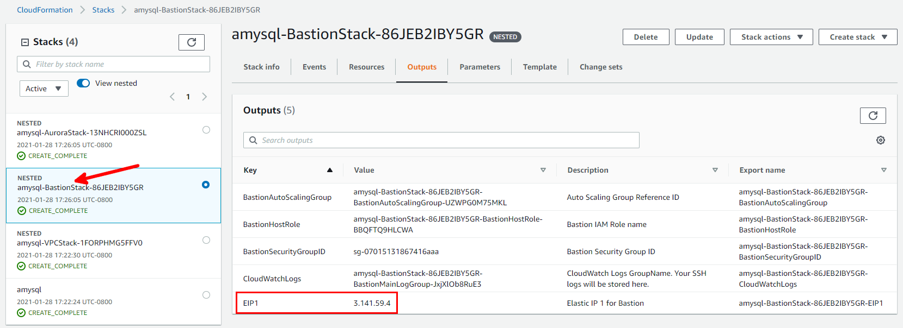
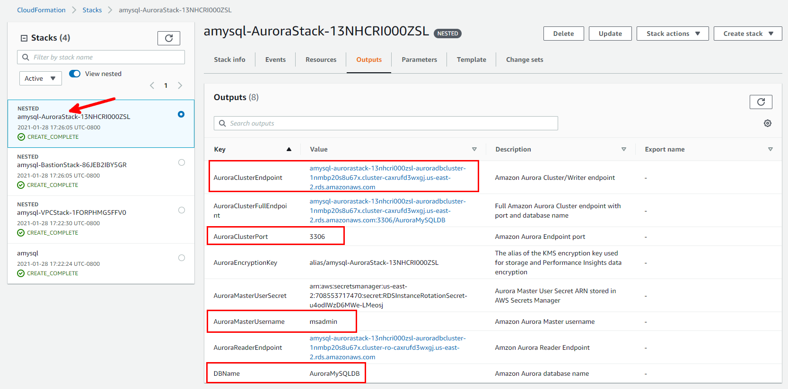
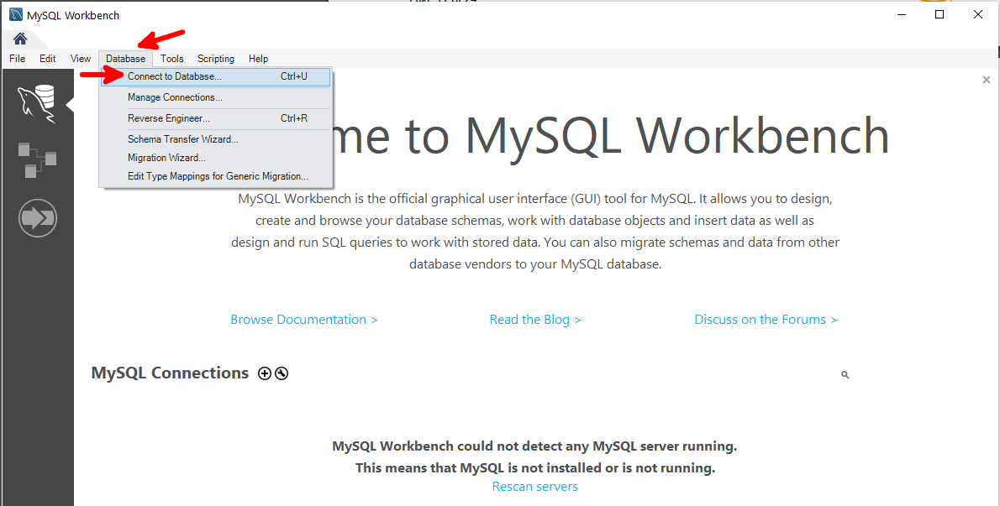
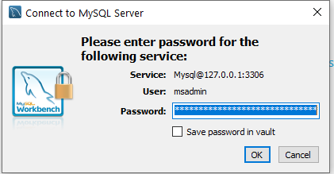
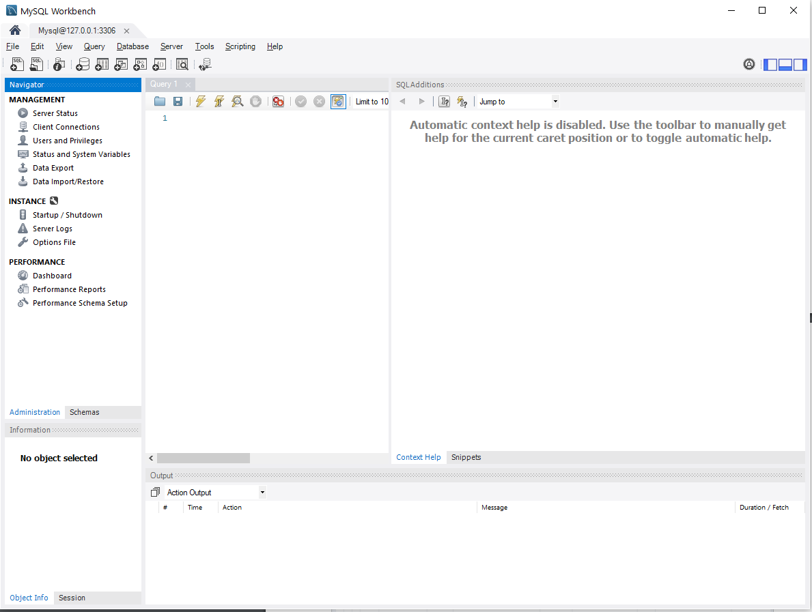
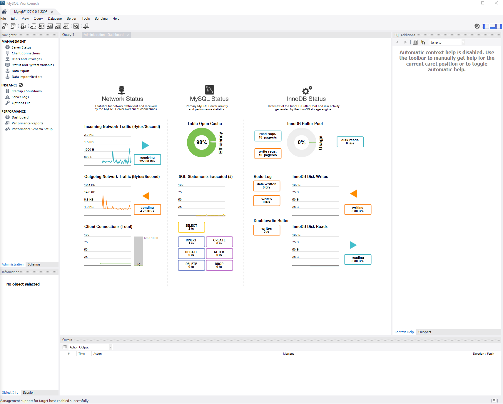

// Add steps as necessary for accessing the software, post-configuration, and testing. Don’t include full usage instructions for your software, but add links to your product documentation for that information.
//Should any sections not be applicable, remove them

== Test the deployment

1. Download the latest version of MySQL Workbench (https://www.mysql.com/products/workbench/) and install it on the workstation from which you will be connecting to the Aurora MySQL DB cluster. 
2. From the AWS CloudFormation console, on the *Outputs* tab for BastionStack, note the value for EIP1, as shown.

[#additional1]
.EIP1 in CloudFormation outputs

[start=3]
3. From the AWS CloudFormation console, on the *Outputs* tab for AuroraStack, note the values of DBName, DBMasterUsername, AuroraClusterEndpoint, and AuroraClusterPort, as shown.

[#additional2]
.DBName, DBMasterUsername, AuroraClusterEndpoint, and AuroraClusterPort in CloudFormation outputs

[start=4]
4. Create an SSH tunnel to the bastion host using the following command. Note that you will need to enter the path for the EC2 key pair that you specified for Key name (KeyPairName) parameter while creating the CloudFormation stack. When you’re finished testing, terminate the SSH tunnel by pressing Ctrl+C.

----
ssh -N -L <AuroraClusterPort>:<AuroraClusterEndpoint>:<AuroraClusterPort> ec2-user@EIP1 -i <KeyPairName>
----

[start=5]
5. Launch MySQL Workbench on your workstation and create a new Database connection by choosing *Database* and choosing *Connect to Database.*

[#additional3]
.Connecting to database using MySQL Workbench

[start=6]
6. Enter the following in the Connect to Database dialogue box.
a. In the Hostname field, enter 127.0.0.1
b. In Port field, enter  the <AuroraClusterPort>
c. In Username, enter the <DBMasterUsername>

[#additional4]
.Database connection options
image::../images/image4.png[additional4]

[start=7]
6. Choose *OK and* enter the <DBMasterUserPassword> password you entered during stack creation. If you choose the value of <RotateDBPassword> parameter as *true* during stack creation, the master password for Aurora MySQL was rotated after creation. In this case, retrieve the new password as follows:
a. From the AWS CloudFormation console, on the *Outputs* tab for AuroraStack, note the values for <AuroraMasterUserSecret>.
b. On the AWS Secrets Manager console, choose the secret you noted above.
c. Choose *Retrieve Secret Value* and copy the password.

[#additional5]
.Entering database password

[start=8]
8. Upon successful connection, you will see a MySQL workbench dashboard, as shown.

[#additional6]
.Successful database connection

[start=9]
9. Choose *Dashboard* under *PERFORMANCE* to see various performance related metrics, as shown.

[#additional7]
.Database performance metrics

