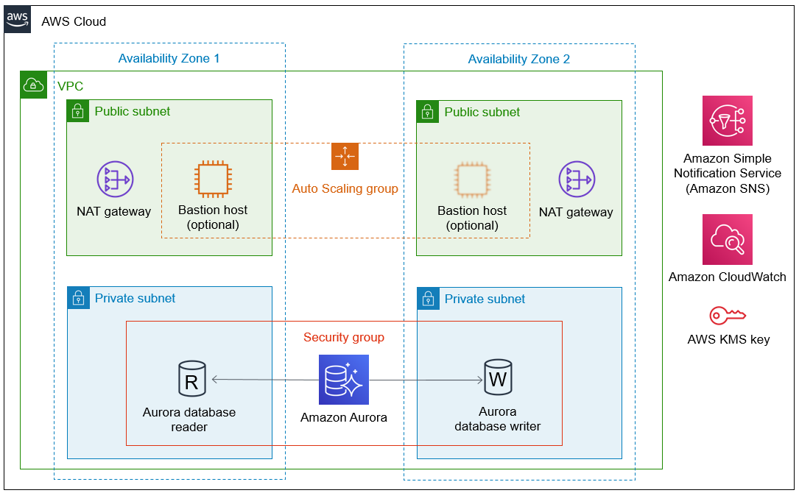

Deploying this Quick Start for a new virtual private cloud (VPC) with
default parameters builds the following {partner-product-short-name} environment in the
AWS Cloud.

// Replace this example diagram with your own. Send us your source PowerPoint file. Be sure to follow our guidelines here : http://(we should include these points on our contributors giude)
[#architecture1]
.Quick Start architecture for _{partner-product-short-name}_ on AWS

As shown in Figure 1, the Quick Start sets up the following:

* A highly available architecture that spans two Availability Zones.*
* A virtual private cloud (VPC) configured with public and private subnets, according to AWS best practices, to provide you with your own virtual network on AWS.*
* In the public subnets:
** Managed network address translation (NAT) gateways to allow outbound internet access for resources in the private subnets.*
** (Optional) A Linux bastion host in an Auto Scaling group to allow inbound Secure Shell (SSH) access to resources in the private subnets.*
* In the private subnets, an Aurora database (DB) cluster in a security group, including one DB reader and one DB writer.
* An Amazon CloudWatch alarm to monitor the CPU on the bastion host and send alarm notifications using Amazon Simple Notification Service (Amazon SNS).
* An encryption key using AWS Key Management Service (AWS KMS). The key enables encryption at rest for the Aurora DB cluster.

[.small]#*The template that deploys the Quick Start into an existing VPC skips
the components marked by asterisks and prompts you for your existing VPC
configuration.#